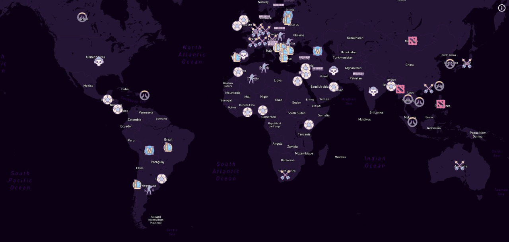

# Game Popularity Map

[Aprenda NextJS, GraphQL e Leaflet na prática!](https://www.udemy.com/course/aprenda-nextjs-na-pratica/) Course Final Project.

A simple project to showcase the most popular games in some countries, based on ["What’s your country’s favorite video game?"](https://www.cabletv.com/blog/popular-video-games-world-map/) research made in 2017!

## Stack

- ⚛️ React.js
- 🧠 Typescript
- 🔮 GraphQL
- ⚛️ Next.js (SSR, SSG, ISR)
- 💅 Styled Components
- 🧪 Jest
- 🔎 SEO
- 🔂 CI/CD & Deploy
- ✏️ GraphCMS
- 🏞 Lazy Load
  
## Preview

  
  